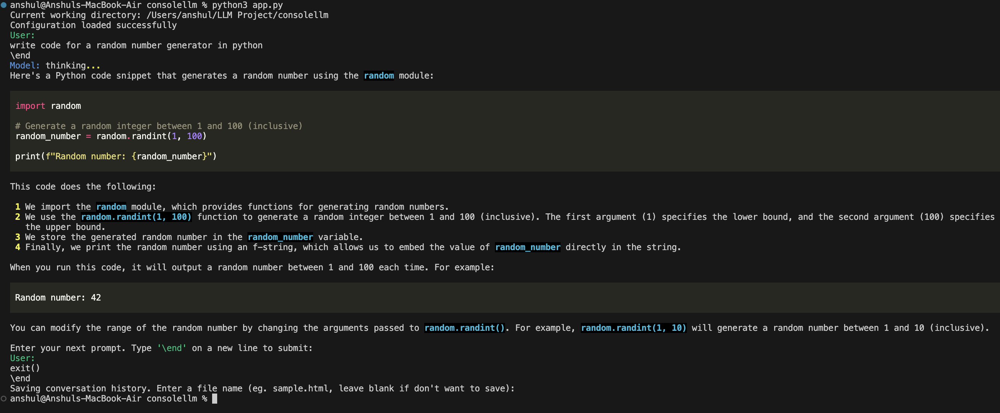

# ConsoleLLM

Access Llama 3.1 405B model from your console
## Installation
```bash
https://github.com/thevoxium/consoleLLM.git
pip install -r requirements.txt
python3 run app.py
```

Or use the package manager pip to install it
```bash
pip install consolellm
```

## Usage

```bash
consolellm
```

## Steps
First time users will be prompted for configuration. Enter your Open Router API key and system prompt (if required). Visit this [page](https://openrouter.ai/settings/keys) to generate the key.

Type the user prompt in the terminal, it can be multiple lines too. To end the prompt, type \end in a new line and press enter. 
To upload a pdf file, type upload() in the terminal, a file uploader will open up, select the file & then enter the prompt, after this type \end in a new line. It's done. 
To exit the chat, type exit() and \end in a new line. User can also save the entire conversation in html format.

Here are sample chat screenshots. 


## License

[MIT](https://choosealicense.com/licenses/mit/)